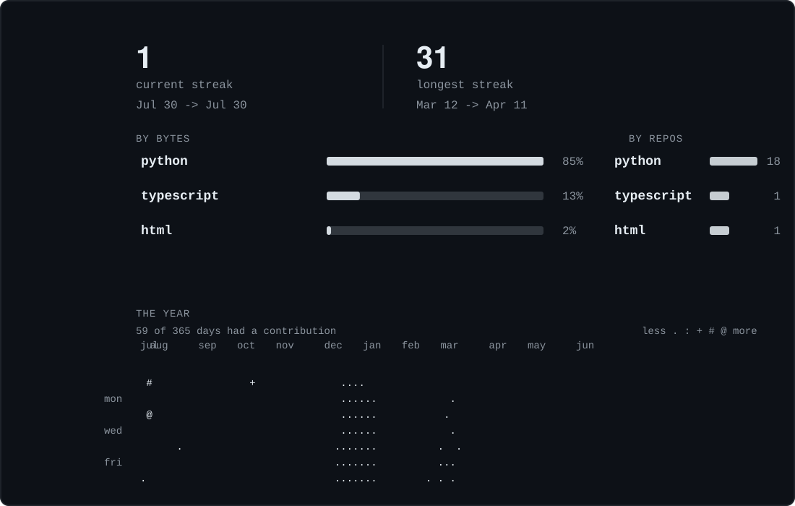

  

  <a href="https://github.com/Arik-code98/Portfolio">portfolio</a>
  &middot;
  <a href="https://github.com/Arik-code98/SmartGrocer">smartgrocer</a>
  &middot;
  <a href="https://github.com/Arik-code98/langgraph-agent">langgraph-agent</a>
  &middot;
  <a href="https://github.com/Arik-code98/codebase-explainer">codebase-explainer</a>

## about

> AI builder focused on practical tools, retrieval workflows, and small systems that are easy to ship and easy to inspect.

I like projects that turn model capability into something a real person can actually use. Most of my public work clusters around Python, RAG, lightweight backend APIs, and developer-facing automation.

## stack

<samp>python&nbsp;&nbsp;typescript&nbsp;&nbsp;fastapi&nbsp;&nbsp;streamlit&nbsp;&nbsp;rag&nbsp;&nbsp;agents&nbsp;&nbsp;github-actions&nbsp;&nbsp;automation</samp>

## projects

[Portfolio](https://github.com/Arik-code98/Portfolio) - <samp>typescript</samp> 
Personal portfolio website.

[SmartGrocer](https://github.com/Arik-code98/SmartGrocer) - <samp>python</samp> 
AI-powered grocery assistant for inventory tracking, expiry reminders, and meal planning.

[langgraph-agent](https://github.com/Arik-code98/langgraph-agent) - <samp>python</samp> 
Agent workflow experimentation built around graph-based orchestration.

[codebase-explainer](https://github.com/Arik-code98/codebase-explainer) - <samp>python</samp> 
Repository understanding and summarization tooling.

[langchain-rag](https://github.com/Arik-code98/langchain-rag) - <samp>python</samp> 
Retrieval-augmented generation patterns and experiments.

## stats

  

## about this page

Everything visual here is generated inside this repository. The portrait comes from `assets/source/portrait.png`, and the stats are rebuilt by the workflow in `.github/workflows/refresh-profile.yml`.
