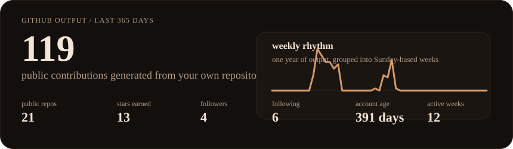
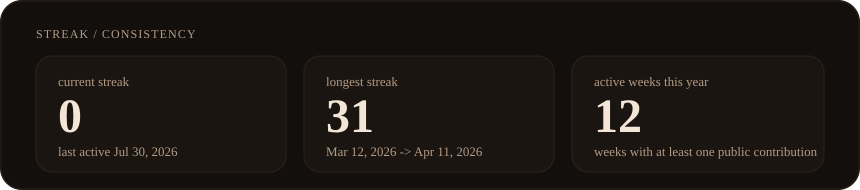
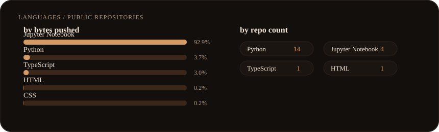
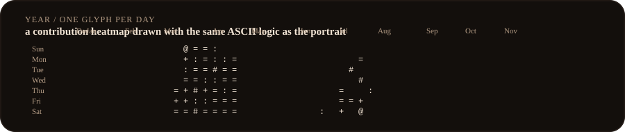

  

> I build practical AI systems, RAG pipelines, and developer tools that turn models into something people can actually use.

  

  

  

  

Everything above is generated from this repository. No third-party profile widgets, no off-repo stat cards, and no dependency on somebody else's theme server staying online.

## Focus

- Building AI products that feel useful, not just impressive in demos.
- Working across retrieval, agent systems, API backends, and simple frontends.
- Keeping projects self-hosted, inspectable, and easy to reason about.

## Selected Work

- [Portfolio](https://github.com/Arik-code98/Portfolio) - Personal portfolio website built with TypeScript.
- [SmartGrocer](https://github.com/Arik-code98/SmartGrocer) - AI grocery assistant for inventory tracking, expiry reminders, and meal planning.
- [langgraph-agent](https://github.com/Arik-code98/langgraph-agent) - Agent workflow experimentation in Python.
- [codebase-explainer](https://github.com/Arik-code98/codebase-explainer) - Repository understanding and summarization tooling.
- [langchain-rag](https://github.com/Arik-code98/langchain-rag) - Retrieval-augmented generation patterns in Python.

## Toolkit

<samp>Python • LangChain • LangGraph • RAG • FastAPI • Streamlit • TypeScript • GitHub Actions</samp>

## Notes

- The portrait is generated from `assets/source/portrait.jpeg`.
- Stats refresh automatically each day through GitHub Actions.
- Pinned repositories and the account bio still need to be managed in the GitHub profile UI.
